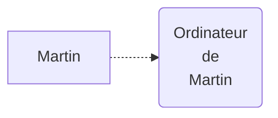
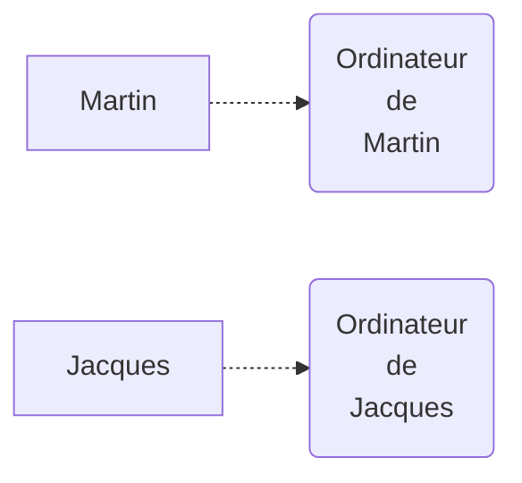
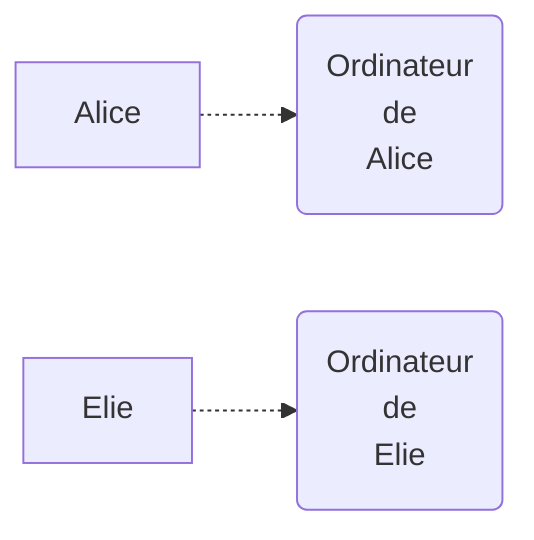
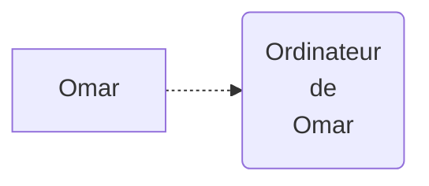
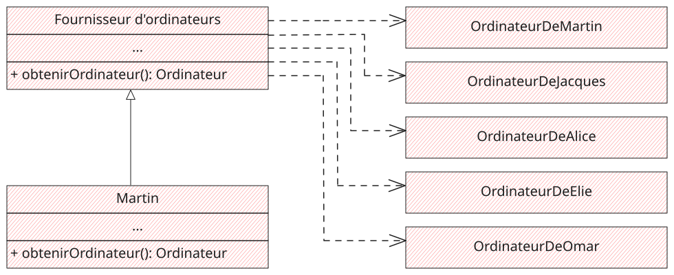
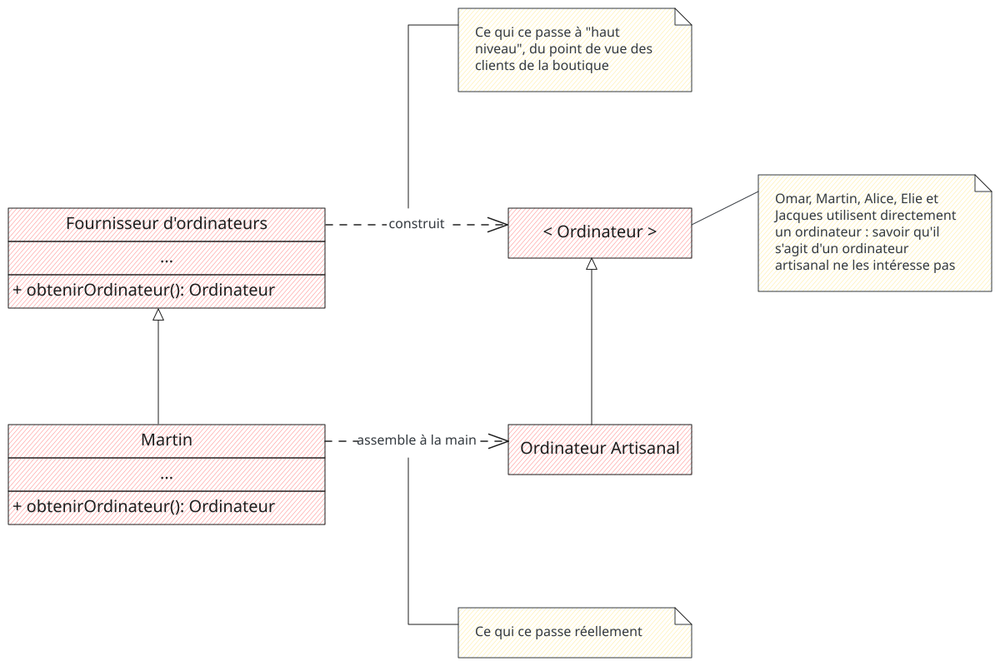
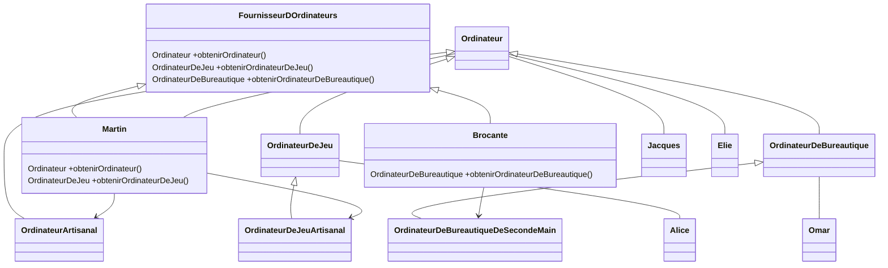

# Martin et le Pattern Factory Method

Partons à la découverte du "Factory Method", Pattern de Création issu du livre <i>Design Patterns: Elements of Reusable Object-Oriented Software</i>,
en suivant Martin, fin bricoleur, qui aide ses amis à construire leurs ordinateurs.

<!-- more -->

Dans le dernier article[^1], je présentais le concept général des Design Patterns.
Aujourd'hui, regardons l'histoire de Martin, qui assemble des ordinateurs.
Martin va être confronté à un problème qu'il va résoudre à l'aide du pattern **Factory Method** (ou **Fabrique simple** en français).

## Le contexte de Martin

Martin souhaite se procurer un ordinateur. 
Il va dans son magasin d'électronique favori où il prend des puces, des condensateurs, et tout un tas de machins et de bidules très précis (Martin est très fort). 
Puis, il rentre chez lui et soude les puces avec les machins et les bidules. 

Et là : il obtient un ordinateur qui fonctionne parfaitement (Martin est très fort).



Mais après le succès, vient la rançon du succès : Jacques trouve que l'ordinateur de Martin est très bien.
Il voudrait exactement le même et demande à Martin les instructions pour le construire aussi.

Jacques (qui est aussi très fort) s'exécute et obtient son ordinateur.



Le schéma se reproduit : Alice, Elie, et Omar veulent également le même ordinateur.
Ils sont tous très doués et reproduisent parfaitement les instructions de Martin.





Mais Martin est embêté.
Le système de watercooling qu'il a mis en place sur son ordinateur (Martin est très fort) ne fonctionne pas parfaitement.
Faisant ses essais, il parvient à un résultat qui lui convient et met à jour ses instructions de montage.
Mais personne ne l'écoute et les ordinateurs fabriqués suivant ses instructions de montage erronés, circulent toujours dans la nature.

Par ailleurs, ses amis lui remontent que les ordinateurs qu'ils utilisent ne leur conviennent pas tous :

- Alice voudrait un PC optimisé pour jouer
- Omar n'a pas besoin d'autant de puissance ; il n'utilise que les outils bureautiques
- Jacques et Elie sont satisfaits de leurs machines

## Le problème de Martin

Martin peut être assimilé à Framework : il est responsable des produits (ordinateur) que les autres produisent à l'aide de ses instructions.
Pour conserver de la cohérence dans le temps et éviter la duplication des instructions de montage, Martin ne peut plus se permettre de continuer à travailler comme il le fait actuellement.

De plus la diversité des produits demandés par ses amis va lui demander de s'organiser pour répondre à leurs besoins.

Martin a donc :

- des produits multiples et similaires (sinon identiques), créés par des acteurs indépendants
- une cohérence à assurer sur les produits dont il est responsable
- besoin de se projeter dans une mise à jour, sans douleur, de la manière sont créés ses produits

## Martin adopte une solution 

Pour répondre à son problème de cohérence, Martin va commencer par centraliser la construction les ordinateurs.


Sur cette étape, Martin n'utilise pas de Design Pattern, mais plutôt le principe de programmation "DRY" (Don't Repeat Yourself (dans le contexte)).
Il mutualise ce qui a de sens et s'assure que les ordinateurs créés répondent à ses critères de qualité.
Puis, il s'organisera pour répondre aux demandes spécifiques d'Alice et Omar.

Martin établit alors une boutique d'ordinateur et propose une interface `Fournisseur d'ordinateurs` que ses amis peuvent utiliser pour obtenir une machine.
Derrière la boutique, c'est toujours MArtin qui s'occupe de créer les ordinateurs : Martin implémente l'interface.



D'ailleurs, toutes les machines partagent des caractéristiques communes : elles implémentent une même interface `Ordinateur`.
Martin rassemble les ordinateurs de ses amis sous un même concept : l'OrdinateurArtisanal. 
Comme il s'agit d'une information dont ils n'ont pas besoin, ils vont utiliser l'interface `Ordinateur`



!!! idea "Pourquoi utiliser des interfaces ?"

    Une interface est queqlque chose qui permet d'introduire des abstractions dans le code.

    Une **abstraction** est un gros mot, pour désigner une "simplification" du code, ou plutôt une **séparation** : 
    on va séparer ce qu'on veut lire au niveau de l'abstraction, des détails qu'on veut masquer pour faciliter la lecture.

    Les détails sont toujours là, mais on peut choisir de les lire à un autre moment.

Martin réalise qu'il a mis en place le **Design Pattern : Factory Method**.
Il dispose des éléments suivants :

- Une interface `Ordinateur` décrivant un objet créé
- Une interface `FournisseurDdinateurs` décrivant la possibilité de se procurer un `Ordinateur`
- Un objet concret `OrdinateurArtisanal` qui va réellement être utilisé par les amis de Martin
- Une **Fabrique** concret `Martin` lui-même qui va construire les `Ordinateur Artisanaux`


## Mais... pour Alice et Omar ?

Dès lors que le code est mutualisé, il est facile de décliner les cas d'usage et de rajouter des comportements dédiés.

TODO
TODO
TODO
Alice et Omar savent qu'ils veulent des ordinateurs spécifiques : ils sont prêts à s'adapter à Martin pour appeler les méthodes spécifiques qui leur fourniront des objets dédiés à leur contexte
TODO
TODO
TODO

- Alice va utiliser une méthode `obtenirOrdinateurDeJeu` qui renvoie un `OrdinateurDeJeu` avec des caractéristiques spécifiques
- Omar va utiliser une méthode `obtenirOrdinateurDeBureautique` qui renvoie un `OrdinateurDeBureautique` avec des caractéristiques spécifiques

Martin va pouvoir traiter ce type de demandes à sa manière :

- Il va lui-même assembler l'ordinateur de jeu pour Alice (car ça l'amuse)
- Il va acheter un ordinateur de seconde main à une `Brocante` pour l'ordinateur de bureautique




## A quoi ça sert ?

Le Pattern Factory Method est, pour moi, le Pattern le plus simple à mettre en œuvre lorsque l'on souhaite séparer les responsabilités de son code.
Il encapsule la création d'un objet derrière une fonction (un couple "interface + méthode" dans la littérature).

Apprendre à reconnaître quand et pourquoi on en a besoin, me semble une première étape importante pour améliorer ses compétences en conception logicielle.

!!! warning "Méthode de création vs. Factory Méthod" 
    
    Déplacer le code de création d'un objet derrière une méthode, n'aboutis pas forcément à implémenter le Design Pattern : Factory Method.
    
    Exemple: Les méthodes de création statique de certains objet, comme `Integer.valueOf()` en Java, sont des méthodes de création, mais ne correspondent pas au pattern (et c'est OK).

### Avantages

Le **Design Pattern : Factory Method** permet de :

- Mutualiser du code dans un contexte applicatif (respect du principe DRY).
    Cela permet de mieux gérer la cohérence des objets que l'on construit et de les faire évoluer de manière plus pérenne.
- N'exposer au client que l'interface dont il a besoin.
    La complexité de la création de l'objet n'a pas besoin d'être exposée.
- Découpler le code de création d'un objet du code qui l'utilise. 
    Même s'ils sont couplés, Ces deux contextes peuvent vivre et évoluer séparément
- Par le nommage de la méthode de création, décrire fonctionnement l'objet créé. 
    Cela donne dui sens à ce que l'on manipule, et permet au client de bien décrire ce dont il a besoin

Un autre avantage, c'est que je le trouve très simple à mettre en œuvre.
Lorsque du code contient du code de création, il suffit de le refactorer de la manière suivante : 

1. Extraire le code de création dans une méthode (on n'implémente pas encore le pattern). 
2. Extraire la méthode dans un objet dédié et instancier cet objet avec les dépendances du code qui l'utilise (Fabrique concrète)
3. Extraire une interface qui présente la méthode de création et utiliser cette interface à la place de votre fabrique concrète.
    La fabrique concrète est toujours instanciée dans les dépendances.
4. Si vous faites de l'injection de dépendance, extraire la fabrique concrète là où vous déclarez vos injections.

Et il est possible de **s'arrêter à n'importe laquelle** des étapes décrites ci-dessus.
Chaque petit pas vers un code amélioré est bon à prendre.
Il n'est pas nécessaire d'aller systématiquement au bout de l'implémentation de ce pattern pour en tirer des bénéfices. 

### Inconvénients

Lorsque les fabriques concrètes ne contiennent pas d'intelligence, elles ne servent alors que d'indirection vers les
constructeurs des objets concrets (ce qui a tout de même l'avantage de permettre de découpler le code).  

### Dans quel cadre je l'utilise

Dès que je crée un objet, je crée une méthode qui encapsule sa création.

#### Quelques Factories célèbres

##### En Java

```java
String value = String.of(anyObject);
```

```java
List<T> aList = List.of(object1, object2, object3, ...);
```

```java
Collection<T> anyCollection = any;
Stream<T> aStream = anyCollection.stream();
```

##### En JavaScript

Cela m'arrive souvent d'utiliser le framework Redux.
Redux utilise des objets, appelés [Actions](https://redux.js.org/tutorials/fundamentals/part-2-concepts-data-flow#actions), pour déclencher des traitements et la mise à jour de l'état de l'application.
Pour simplifier l'utilisation de ces actions et mutualiser leur création, je passe par des **Factory Methods**.

### Dans quel cadre je ne l'utilise pas

Parfois, lorsque l'instanciation d'un objet est fortement couplée avec le contexte dans lequel il est utilisé, je ne l'utilise pas.
<br>Par exemple, lorsque l'on utilise le Pattern Decorator, on souhaite souvent manipuler l'objet décoré (implémentation concrète) plutôt qu'une interface plus abstraite.

_Et voilà_[^2]

Le **Design Pattern : Factory Method**, est l'un des 5 Pattern de Création (`Abstract Factory`, `Builder`, `Factory Method`, `Prototype`, `Singleton`).
Il s'agit de toutes les mécaniques ayant trait à la construction des objets, et pas uniquement dans la Programmation-Orientée-Objet (POO, ou OOP en anglais).
Ces Patterns apportent de la flexibilité au code, en mettant en évidence les questions :

- Qu'est-ce qui est créé ?
- Qui le crée ?
- Comment cela est créé ?
- Quand cela est créé ?

Vous savez tout (ce que je sais) sur le **Design Pattern : Factory Method**.

---

Merci de m'avoir lu et bonne journée 🌞
<br>
Fabien

---

**Bibliographie et liens utiles**

- 🔗 [Factory Method - Vince Huston](http://www.vincehuston.org/dp/factory_method.html) : des schémas, des explications et des exemples de C++ et Java sur les Design Patterns du Gof.
- 🔗 [Fabrique - Refactoring Guru](https://refactoring.guru/fr/design-patterns/factory-method) : en français et toujours très complets même s'il y a beaucoup de redite du GoF, 

[^1]: sur ce site : "[Les Design Patterns : les Gammes de la conception logicielle](https://fhiegel.github.io/blog/2022/01/13/les-design-patterns--les-gammes-de-la-conception-logicielle/)"
[^2]: En français dans le texte

*[GoF]: Design Patterns: Elements of Reusable Object-Oriented Software
*[refactorer]: Changer la structure du code, sans en changer le comportement.
*[DRY]: Don't Repeat Yourself