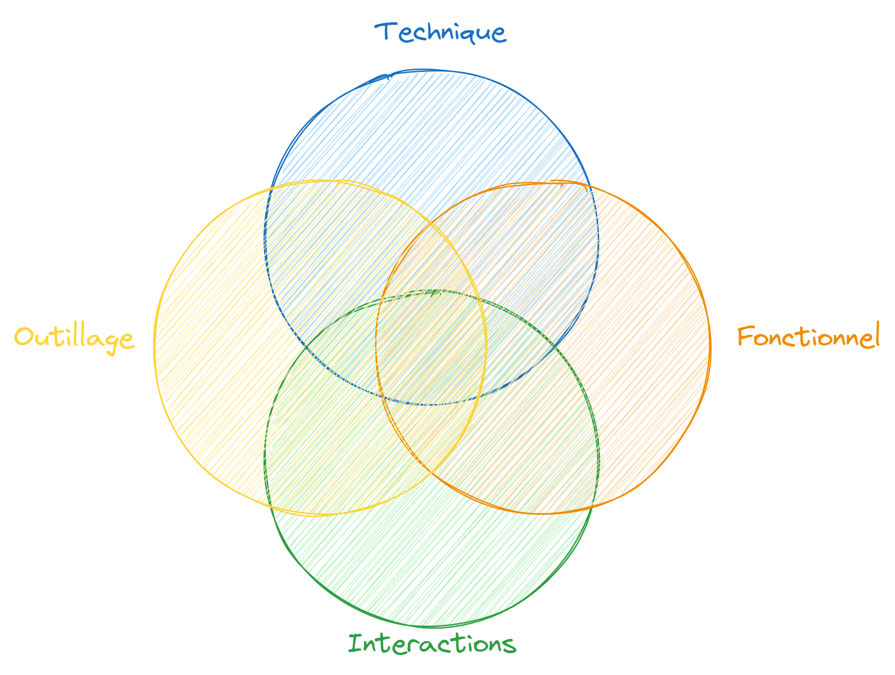
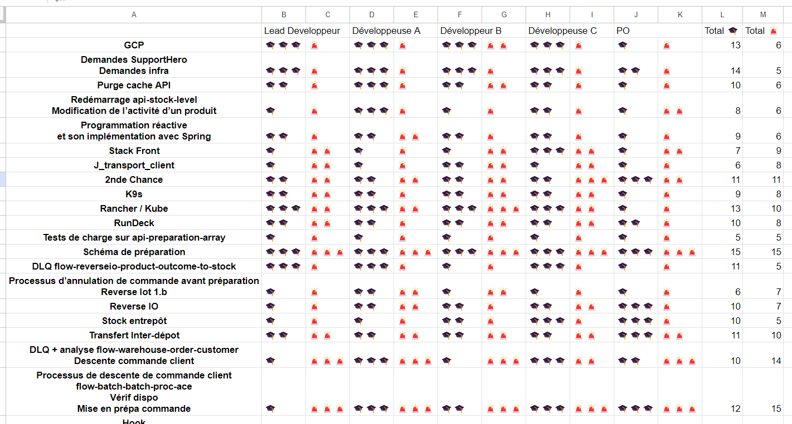
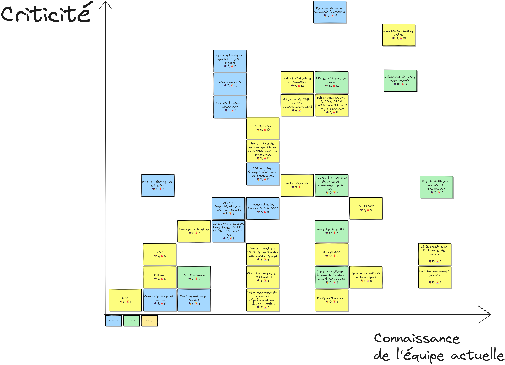

# Matrice des connaissances : Cartographier le savoir de votre équipe

!!! workshop inline end "L'atelier en bref"
    

      

        
🕓 **Durée** 

        
 🕓1h-1h30

      

      

        
👥 **Participants** 

        
 👥2-n

      

      

        
🌶️ **Difficulté** 

        
 🌶️ Simple

      

      

        
🎯 **Objectif** 

        
 🤝 Partager

      

    

    Mettre en évidence les compétences et les connaissances des personnes de l'équipe et expliciter des actions à
    mener pour limiter les risques liés à la perte.

Dans le cadre d'une mission, j'ai eu à accompagner plusieurs équipes dans lesquelles nous avons dû faire face à des
départs.

Comment accompagner au mieux ces départs ? Nous avons besoin d'**extraire la connaissance** des personnes sortantes, et de
**faciliter leur transmission** aux personnes qui restent.

Pour cela, j'ai eu l'occasion de formaliser et de dérouler un atelier de **matrice des connaissances**, qui a été assez
bien reçu par les équipes.

<!-- more -->

Cet atelier est fortement inspiré de deux autres formats

- La Skill Matrix
- Un atelier d'idéation

## Déroulé

Comme beaucoup d'ateliers que je rencontre, cet atelier a deux phases : divergence puis convergence.

* Introduction : 🕓 5mins
* Idéation : 🕓 5 mins
* Convergence : 🕓 20-30 mins
* Évaluer les connaissances : 🕓 5mins
* Évaluer les risques : 🕓 5mins

### Idéation

C'est le moment de faire émerger toutes les connaissances en lien avec l'équipe, qu'elles soient nécessaires, utiles ou*
anecdotiques, en les écrivant sur des post-its à placer sur un Ikigai (quatre grands cercles qui se recoupent) qui présente 
les axes "Technique ↔ Interaction" et "Fonctionnel ↔ Outillage" pour guider l'idéation.

### Détail des axes

* **Technique** : tout ce qui est lié au développement, aux Frameworks, au spécificité de code ou de pratique autour du
  logiciel
* **Interaction** : toute connaissance/compétence faisant intervenir une interaction avec une autre équipe
* **Fonctionnel** : tout ce qui a trait au fonctionnel/métier que l'on utilise
* **Outillage** : tout ce qui est relatif aux outils que l'on utilise.

### Convergence

Relire ensemble toutes les idées pour s'assurer que tout le monde comprenne bien le sujet dont il est question.
Dédoublonner les post-its. Créer de nouveaux post-its. Regrouper les sujets similaires ensemble

### Évaluer les connaissances

Tout le monde évalue avec une note de 1 à 3 sa connaissance personnelle du sujet porté par le post-it :

* 🎓🎓🎓 Sujet bien connu
* 🎓🎓 Connaissances superficielles
* 🎓 Entendu parler du sujet (au moins au cours de l'atelier)

Chacun s'exprime sur chaque post-it. On n'est pas là pour juger de la note, mais pour avoir une idée du ressenti global
de toutes et tous.

### Évaluer les risques

Tout le monde évalue avec une note de 1 à 3 sa impression personnelle de la criticité du sujet pour l'équipe :

* 🚨🚨🚨 Connaissance **Indispensable**
* 🚨🚨 Connaissance **Nécessaire** / Utile
* 🚨 Connaissance Utile / de **Confort** pour le projet

Chacun s'exprime sur chaque post-it. On n'est pas là pour juger de la note, mais pour avoir une idée du ressenti global
de toutes et tous.

## Post traitement

### Compiler les données

Une fois qu'on a collecté les données, il faut déterminer ce qu'on en fait. Pour ça, j'ai mis les données dans un
tableau en calculant le total "Connaissance" et le total "Criticité".

### Tracer la matrice

Ça permet ensuite de construire une matrice, semblable à la matrice d'Eisenhower. On place les éléments en fonction de la **connaissance
disponible** dans l'équipe, et de la **criticité** et en cas d'égalité, on se débrouille pour tout faire apparaître (quitte à
déplacer d'autres éléments).

L'objectif est d'avoir quelque chose d'exploitable plutôt que quelque chose de mathématiquement parfait. 
C'est souvent plus important d'avoir les éléments positionnés relativement les uns par rapport aux autres que des éléments parfaitement placés.

D'ailleurs, j'ai construit ça à la main, car je n'ai pas trouvé d'outil chouette qui le ferait à ma place.
Les outils que j'ai trouvés me superposent les éléments qui ont les mêmes coordonnées, alors que je voudrais pour voir
les ordonner pour tout faire apparaître.

🤔 Si vous connaissiez un outil qui pourrait le faire, je suis preneur.

Après avoir positionné les éléments les uns par rapport aux autres avec une équipe, on a rajouté un code couleur pour 
savoir si une info est plutôt technique ou fonctionnelle.
Si on veut avoir une info très précise, on peut retravailler les données brutes sur l'étape 1 (l'Ikigai où on a les axes)
et rajouter une échelle de notation.

L'important est surtout de savoir si

* une compétence/connaissance est maîtrisée par une ou plusieurs personnes
* une compétence/connaissance est nécessaire à une ou plusieurs personnes

Le résultat donne un truc comme ça :

### Analyser la matrice

Là, on arrive à la fin de l'exercice, on a une matrice qui appartient à l'équipe. Où toutes les infos utiles/nécessaires/critiques à l'équipe sont renseignées. Et que l'on peut faire évoluer : pas forcément besoin de refaire tout l'exercice, mais déplacer/repositionner les éléments.

Et surtout, on est en mesure de tracer des **quadrants :**
 
* ce qui est **très critique** et **peu connu** (↖️ en haut à gauche) :
  il y a un gros risque à ne pas faire de passation de connaissance ⇒ urgent de réfléchir à un plan d'action
* ce qui est **très critique** et **très connu** (↗️ en haut à droite)
  risque mitigé est c'est le coeur de métier de l'équipe. Est-ce qu'on a ce qu'il faut pour onboarder rapidement de nouvelles personnes et pour faire en sorte que la connaissance ne se perdre pas ?
* ce qui est **peu critique** et **très connu** (↘️ en bas à droite) : 
  des choses qui sont utilisés dans le quotidien de l'équipe. A priori, peu d'action à mener sur ce quadrant, mais c'est chouette d'identifier ces forces
* ce qui est **peu critique** et **peu connu** (↙️ en bas à gauche) : 
  ce sont souvent des connaissances satellites à l'équipe, qui sont connues par d'autres équipes, ou dont on fait très rarement l'usage. 
  Pas d'action à prévoir. S'il y a une montée en compétence/connaissance à faire, on se débrouillera le moment venu.

## Aller plus loin

Effectuer cet exercice une seule fois permet de cartographier les connaissances de l'équipe, et de mettre en évidence 
des actions pour limiter les risques liées à la perte de connaissance.

Mais, l'artefact que vous obtenez, a de la valeur pour accueillir de nouveaux arrivants dans l'équipe. Il peut servir à 
présenter les connaissances nécessaires pour être opérationnel, et prioriser les efforts des nouveaux arrivants.

Par ailleurs, l'équipe évolue, et les connaissances changent. Cela peut être intéressant de réaliser cet exercice à 
intervalles réguliers pour évaluer la progression de l'équipe, ou visualiser un changement de scope ; des connaissances
peuvent désormais être moins importantes, et de nouvelles connaissances peuvent apparaître.

À titre personnel, je pratique également cet exercice seul. Cela me permet de savoir quelles sont les connaissances qui 
me rendent indispensables, et les transmissions que je dois prévoir avant de pouvoir quitter un contexte en toute sérénité.

--- 

Merci de m'avoir lu et bonne journée 🌞
 
Fabien
