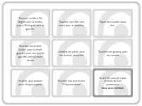

# Pair Practice : un serious game pour s'entraîner sans coder

> 🕗 30mins | 👯 Présentiel | 🌶️ Accessible à tous
>
> 🧩 Serious Game | 🛠️Atelier

Sur le principe, je sais ce qu'est le binômage et j'essaie d'en faire.
Mais, comment m'entraîner ?
Comment donner un aperçu rapide de la pratique sans braquer mon équipe vis-à-vis du code ?

Sans utiliser de code, cet exercice donne une idée de ce qu'est le binômage et permet de prendre du recul sur notre manière de pratiquer.

## Préparation

> Cet atelier vient de Bill Wake : [Pair Practice][pair-practice], publié en 2004.

Durée : 20-30 minutes

Matériel :

- Une liste de 10 tâches par binôme de participants, pensez bien à garantir une "tâche de fin" par binôme

Mise en place :

- Chacun pioche deux cartes dans la liste des tâches, une qui sera sa "bonne compétence", l'autre sa "mauvaise compétence", les mémorise et les remet dans la liste des tâches
- Séparez les participants en binômes,
- Dans chaque binôme, désignez un acteur
- L'acteur commence debout, immobile
- Mélangez la liste des tâches et faites-en une pile, faces cachées, hors de portée de lecture de l'acteur.
  - Faites en sorte que la dernière tâche de la pile soit "Ouvrez les yeux et tapez la main de votre partenaire : vous avez terminé."

Vous êtes prêts à commencer l'atelier.

## Déroulé

- Lorsque vous n'êtes pas acteur : retournez la première tâche, lisez-la à voix haute
- Lorsque vous êtes acteur : Fermez les yeux, accomplissez votre tâche, puis remettez-vous en position : debout, immobile et dites "OK !"
- Tant qu'il y a des tâches dans la pioche, continuez à les réaliser

Quelques contraintes : 

- Si la tâche correspond à la "bonne compétence" du partenaire de l'acteur, ce dernier devrait dire "Est-ce que je peux prendre la main ?" et les participants inversent les rôles
- Si la tâche correspond à la "mauvaise compétence" de l'acteur, ce dernier devrait dire "Est-ce que tu peux prendre la main ?" et les participants inversent les rôles
- Il est interdit d'être acteur sur plus de trois tâches d'affilées

## Débriefing

Posez-vous les questions suivantes et tentez d'y répondre en groupe.

- Est-ce que tout le monde a réussi à respecter toutes les consignes ? Si non, pourquoi ?
- Est-ce que l'un des participants a été acteur tout au long de la session ?
- Est-ce que le partenaire a été utile à l'acteur ?
- Est-ce que le partenaire a pu vérifier que toutes les tâches avaient été faites ? et faites correctement ?
- Est-ce que vous avez trouvé les questions "Est-ce que je/tu peux prendre la main ?" gênantes ?
- En termes de coûts, dépiler cette liste de tâche en binôme était-il justifié ?
- Tout seul, auriez-vous fini cette liste de tâches plus rapidement ? Que se serait-il passé si la tâche associée à votre "bonne compétence" vous aurait pris dix fois moins de temps qu'une tâche normale et que votre "mauvaise compétence" vous aurait demandé dix fois plus de temps ?

L'objectif de l'exercice n'est pas de convaincre directement tous les participants, mais de faire en sorte que chacun se pose des questions sur sa pratique au quotidien.

## Annexes

Liste des tâches à imprimer (pdf) : 

Liste des tâches :

- Rester en équilibre sur un pied pendant sept secondes.
- Tendre son bras en l'air et compter jusqu'à trois.
- Toucher sa tête, puis les épaules, les genoux et pieds.
- Tourner sur soi-même une fois vers la gauche.
- Toucher ses yeux, puis ses oreilles, bouche et nez.
- Tapoter sa tête.
- Frotter son estomac.
- Tapoter sa tête et frotter son estomac en même temps.
- Toucher son nez et dire "Chrysanthème".
- Taper des mains deux fois.
- Tourner sa tête à 90 degrés vers la droite, puis à 90 degrés vers la gauche.
- Toucher trois fois son torse avec le menton.
- Taper des coudes deux fois.
- Toucher son oreille droite  avec sa main gauche, puis son oreille gauche avec sa main droite
- Joindre ses pieds, puis les écarter, deux fois
- Toucher ses genoux avec ses coudes
- Inspirer, puis expirer pour chaque voyelle
- Toucher son nez et dire "Chrysanthème"
- Ouvrez les yeux et tapez la main de votre partenaire : vous avez terminé.
    - Faites en sorte que ce soit la dernière tâche de l'exercice pour finir sur une victoire

[pair-practice]: https://xp123.com/articles/pair-practice/