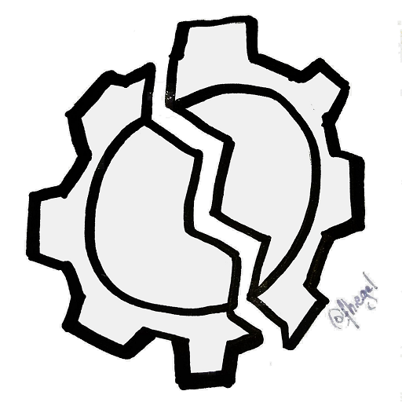
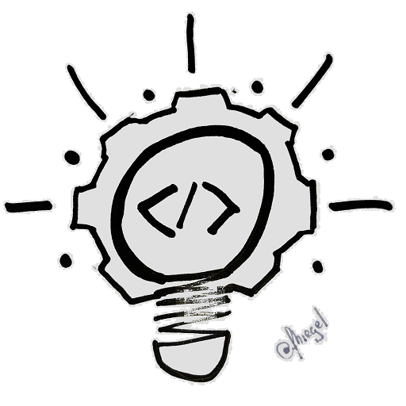
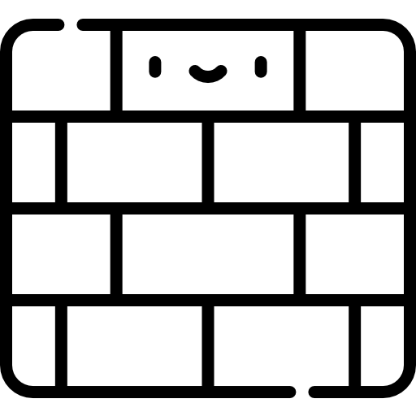

#### Le
# Triangle
## Du
# Développement

---

# 3
## états d'esprits

---

# Red

--

## Clarifier le besoin

Notes:

POURQUOI

https://www.flaticon.com/free-icon/desire_1107497?term=need&related_id=1107497

--

## Clarifier l'usage

Notes:

POURQUOI

https://www.flaticon.com/free-icon/solution_2345250)

--

## Documenter le besoin

My own picture

Notes:

QUOI

--

## Livrer des tests

My own picture

Notes:

QUOI

---

# Green

[//]: # (![]&#40;/assets/images/topics/tdd/triangle-du-developpement/checked.png&#41;)

Notes:

https://www.flaticon.com/free-icon/control-system_3712234

--

## Corriger le comportement

Notes:

QUOI

https://www.flaticon.com/free-icon/settings_654705?term=repair%20gear&page=1&position=37&page=1&position=37&related_id=654705&origin=search

--

## Livrer une application 

Notes:

QUOI

https://www.flaticon.com/premium-icon/delivery-box_2982666

--

## Savoir quand on a terminé 

Notes:

POURQUOI

ttps://www.flaticon.com/premium-icon/done_3082729

--

## S'affranchir de la pression de réussir

Notes:

POURQUOI

---

# Refactor

--

## Design == Décision

Notes:

POURQUOI
Design émergent

https://www.flaticon.com/free-icon/puzzle_6370962

--

## Faire fonctionner, n'est que la moitié

Notes:

POURQUOI

https://www.flaticon.com/premium-icon/experience_2343257

--

## Corriger la structure

Notes:

QUOI
https://www.flaticon.com/premium-icon/brickwall_3108854

--

## Livrer de la pérennité

Notes:

QUOI
https://www.flaticon.com/free-icon/wall_1141844

---

# 3
## Règles fondamentales

--

## #1. Permis de coder

Notes:

> Il est interdit d'écrire du code de production, 
> 
> tant qu'il n'existe pas au moins un test en erreur, prouvant la nécessité du code

https://www.flaticon.com/free-icon/card_2456552

--

## #2. Une seule question à la fois

Notes:

> Il est interdit d'écrire plus d'un test en erreur à la fois

https://www.flaticon.com/free-icon/filter_4080734

--

## #3 Connaissez les limites !

Notes:

> Il est interdit d'écrire plus de code que nécessaire pour faire passer le test en cours.

https://www.flaticon.com/premium-icon/limit_2211654

---

# 1
## Triangle

---

## Crédits images

- <a href="https://www.flaticon.com/free-icons/delivery" title="delivery icons">Delivery icons created by Freepik - Flaticon</a>
- <a href="https://www.flaticon.com/free-icons/tick" title="tick icons">Tick icons created by Roundicons - Flaticon</a>
- <a href="https://www.flaticon.com/free-icons/done" title="done icons">Done icons created by SBTS2018 - Flaticon</a>
- <a href="https://www.flaticon.com/free-icons/system" title="system icons">System icons created by noomtah - Flaticon</a>
- <a href="https://www.flaticon.com/free-icons/heart" title="heart icons">Heart icons created by noomtah - Flaticon</a>
- <a href="https://www.flaticon.com/free-icons/gear" title="gear icons">Gear icons created by Eucalyp - Flaticon</a>
- <a href="https://www.flaticon.com/free-icons/brain" title="brain icons">Brain icons created by Freepik - Flaticon</a>
- <a href="https://www.flaticon.com/free-icons/solution" title="solution icons">Solution icons created by srip - Flaticon</a>
- <a href="https://www.flaticon.com/free-icons/filter" title="filter icons">Filter icons created by phatplus - Flaticon</a>
- <a href="https://www.flaticon.com/free-icons/limit" title="limit icons">Limit icons created by noomtah - Flaticon</a>